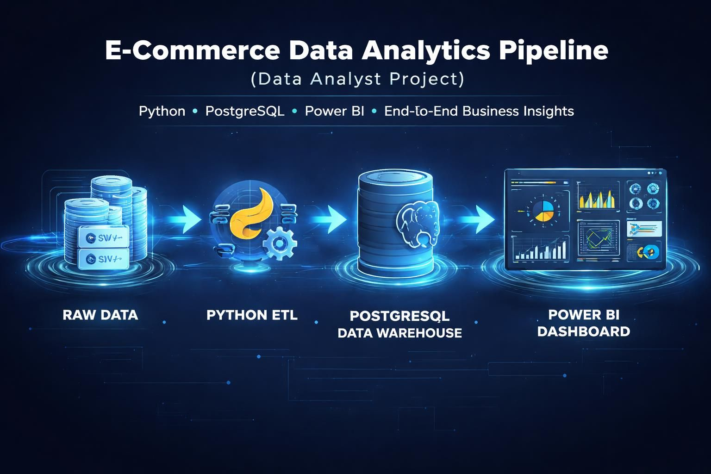
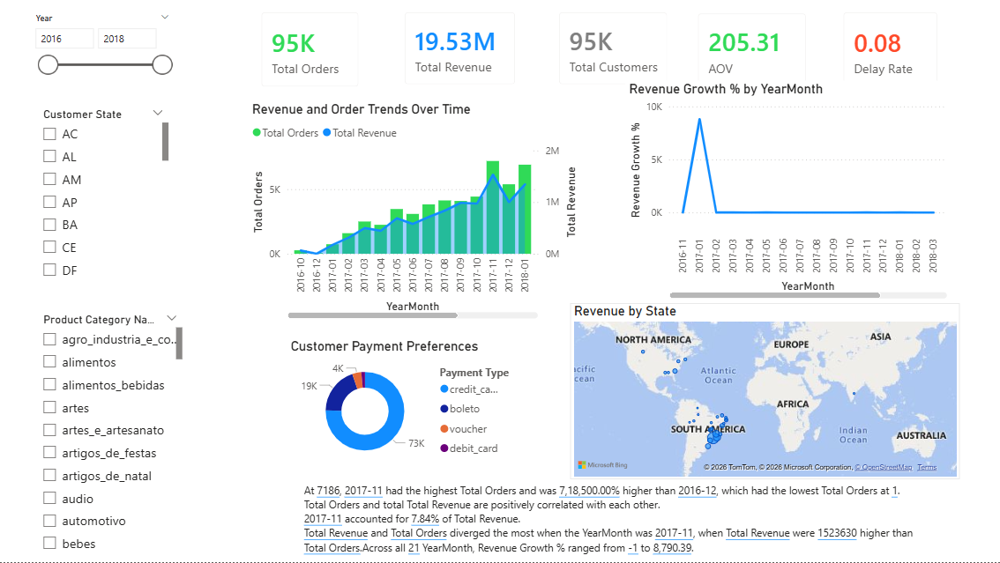
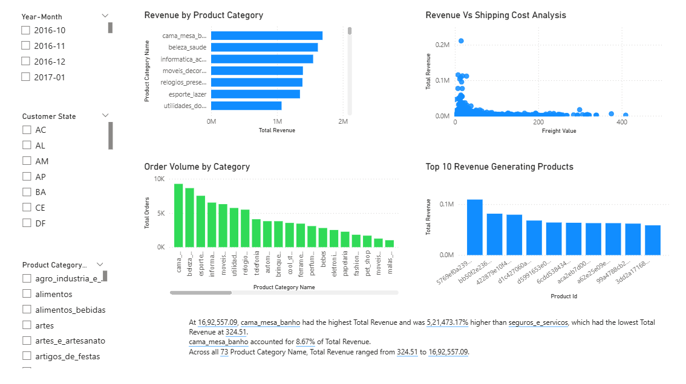
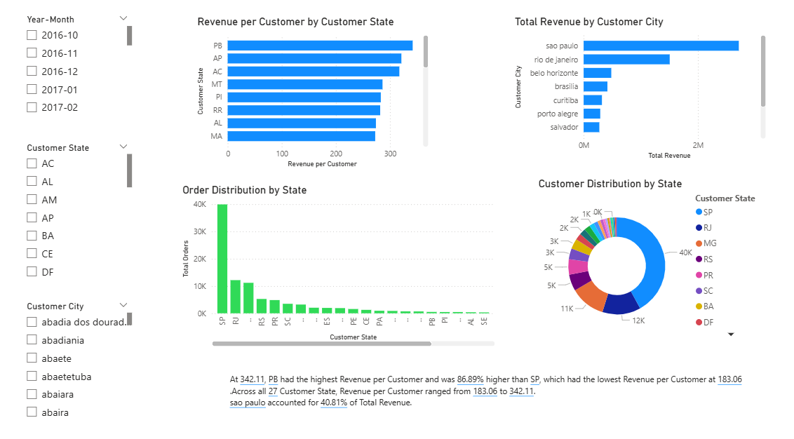
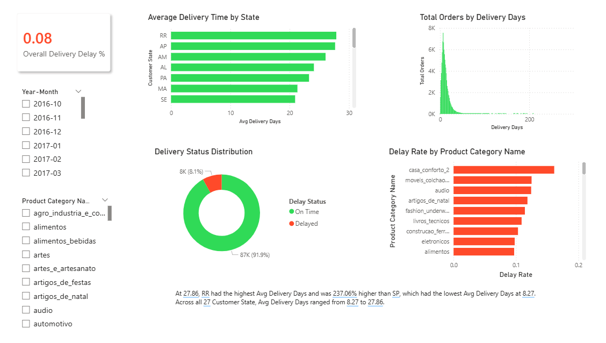

<p align="center">
  
</p>

# Ecommerce Data Analytics Pipeline
End-to-end e-commerce data analytics pipeline using Python, PostgreSQL, and Power BI to analyze delivery performance, delay rates, and business insights.

## 📊 Project Overview

This project is an end-to-end **data analytics pipeline** that analyzes e-commerce revenue performance and delivery efficiency using **Python, PostgreSQL, and Power BI**.

It focuses on identifying delivery delays, regional performance variations, and product category inefficiencies using a structured data engineering and BI workflow.

---

## 🎯 Objectives

* Analyze overall delivery delay rate
* Identify high-delay product categories
* Evaluate state-wise delivery performance
* Measure average delivery time
* Build an end-to-end analytics pipeline using industry-style architecture

---

## 🛠️ Tech Stack

* **Python** – Data ingestion & transformation (ETL pipeline)
* **PostgreSQL** – Data warehouse (fact & dimension modeling)
* **SQL** – Data querying & business logic
* **Power BI** – Dashboard creation & DAX-based analytics

---

# 🧭 Data Architecture

This project follows a **layered analytics architecture** inspired by modern data engineering systems.

```
                    📦 E-COMMERCE ANALYTICS PIPELINE

┌──────────────────────────────┐
│        RAW DATA LAYER        │
│                              │
│  ecommerce_data.csv          │
└──────────────┬───────────────┘
               │
               ▼
┌──────────────────────────────┐
│     PYTHON INGESTION LAYER   │
│   (src/ingestion/ingest.py)  │
│                              │
│  - Load CSV                  │
│  - Insert into PostgreSQL    │
└──────────────┬───────────────┘
               │
               ▼
┌──────────────────────────────┐
│   DATA WAREHOUSE LAYER       │
│        POSTGRESQL            │
│                              │
│  - Fact Tables               │
│  - Dimension Tables          │
│  - Structured Schema         │
└──────────────┬───────────────┘
               │
               ▼
┌──────────────────────────────┐
│  TRANSFORMATION LAYER        │
│ (src/transformation/)        │
│                              │
│  - Data cleaning             │
│  - Feature engineering       │
│  - Business logic prep       │
└──────────────┬───────────────┘
               │
               ▼
┌──────────────────────────────┐
│   SEMANTIC / BI LAYER        │
│        POWER BI              │
│                              │
│  - DAX Measures              │
│  - KPIs                      │
│  - Interactive dashboards    │
└──────────────────────────────┘
```

---

## ⚙️ Data Pipeline (Python)

### 🔹 Ingestion Layer

* Script: `src/ingestion/ingest.py`
* Reads raw CSV data
* Loads structured data into PostgreSQL

### 🔹 Transformation Layer

* Script: `src/transformation/transform.py`
* Handles:

  * Data cleaning
  * Type conversions
  * Feature preparation
* Produces analysis-ready datasets

---

## 📁 Project Structure

```
ecommerce_revenue_analysis/
│
├── dashboards/              # Power BI (.pbix) dashboards
│
├── data/
│   ├── raw/
│   │   └── ecommerce_data.csv
│   └── processed/           # Cleaned datasets (generated)
│
├── logs/                    # Execution logs (auto-generated)
│
├── src/
│   ├── ingestion/
│   │   └── ingest.py
│   └── transformation/
│       └── transform.py
│
├── venv/                    # Virtual environment
│
└── README.md
```

---

## 📈 Key Metrics

### 🔹 Overall Delay Rate

* **7.83%** of total orders are delayed

---

### 🔹 Delay Rate by Product Category

* Highest delay categories:

  * `casa_conforto_2` – 16.13%
  * `moveis_colchao_e_estofado` – 12.50%
  * `audio` – 12.43%
* Lowest delay categories:

  * Several categories show minimal or zero delay

---

### 🔹 Delay Rate by State

* Highest delay states:

  * AL – 24.49%
  * MA – 20.54%
  * PI – 15.93%
* Lowest delay states:

  * AC – 3.26%
  * RO – 4.00%
  * AM – 4.19%

---

### 🔹 Average Delivery Time

* **12.01 days**

---

### 🔹 Delivery Time by State

* Slowest delivery:

  * RR – 27.86 days
  * AP – 27.66 days
* Fastest delivery:

  * SP – 8.27 days

---

## 📊 Power BI Dashboard Features

---

## 📸 Dashboard Preview

### 📊 Overview Dashboard


### 📦 Product Category Insights


### 🌍 Customer Analysis


### 🚚 Delivery Performance Analysis

---

* KPI cards (delay rate, avg delivery time)
* Category-wise performance analysis
* State-wise geographic insights
* Interactive filtering and drill-down
* DAX-based calculated metrics

---

## 🔍 Key Insights

* Remote regions experience significantly higher delivery times
* Product category impacts delivery performance
* Strong correlation between geography and delay rate
* Urbanized states show faster logistics efficiency

---

## 🚀 Recommendations

* Strengthen logistics in high-delay regions
* Improve handling for bulky product categories
* Optimize regional distribution strategy
* Use predictive analytics for delay forecasting

---

## 📌 Conclusion

This project demonstrates a complete **data engineering + analytics pipeline**, moving from raw data ingestion to structured warehousing and interactive BI dashboards. It reflects a real-world layered architecture used in modern analytics systems.

---

## ▶️ How to Run This Project

### 1. Setup Environment

```bash
python -m venv venv
source venv/bin/activate   # Windows: venv\Scripts\activate
pip install -r requirements.txt
```

### 2. Run Python Pipeline

```bash
python src/ingestion/ingest.py
python src/transformation/transform.py
```

### 3. Run SQL Analysis

* Open PostgreSQL (pgAdmin)
* Execute analytical queries

### 4. Open Power BI Dashboard

* Load `.pbix` file from `/dashboards`
* Explore insights interactively

---

## 👨‍💻 Author

* MD SARFARAZ ALAM

---
